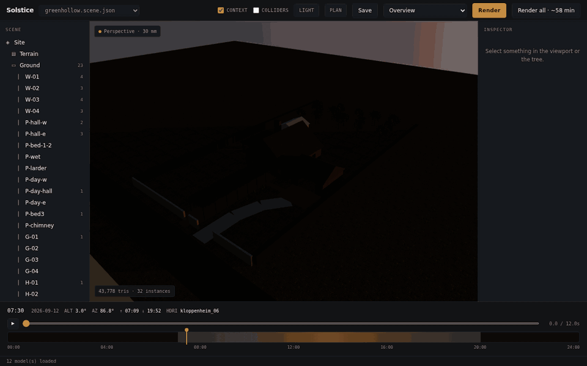
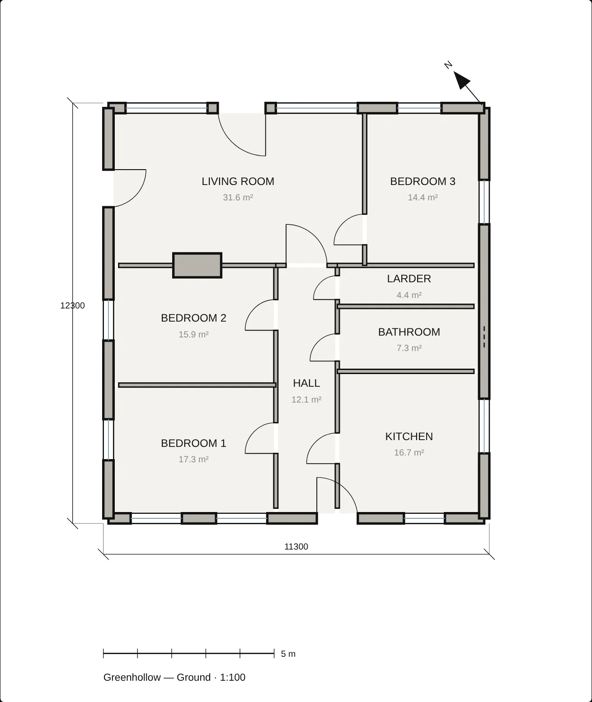

# Solstice

A browser editor and path-traced renderer for one house and its plot, for anyone who wants to see a design under the sun it would really get, on a real date at a real place.

<p align="center">
  
</p>

**Status:** Personal project in active development. All 72 planned tasks in the [project wiki](corpus/wiki/status.md) are done, the latest on 2026-10-07. It runs locally only, with no hosted copy. The editor works in any WebGL2 browser. The path tracer needs a real GPU, and a headless browser under WSL2 falls back to software and cannot finish a render.

## What it does

- Opens a house and its plot in a WebGL2 viewport where you orbit, select and edit walls, their openings and placements, and drop furniture onto the floor below it. Three scenes come bundled: a smallholding, a two-storey town house and a test fixture.
- Puts the sun where it would be for the scene's latitude, longitude, date and time, and plays a keyframed sun-path study across the day on a timeline.
- Path-traces a named shot, or the whole shot list unattended, at each shot's own camera, clock and resolution, and saves the stills to your machine.
- Draws a measured floor plan as SVG from the same document, with room names, areas and door swings.
- Lints every scene for mistakes a schema cannot catch, such as a window on a wall that does not exist or two openings that overlap.

Scenes are TypeScript modules in the repo, written by a person working with an AI assistant, and they compile to JSON documents the linter checks. A design is therefore a text file you can diff and review, which a SketchUp or Blender file is not. The browser only tweaks, lights and looks. It has no LLM inside, no freehand CAD drawing, and it renders stills, never an animated sequence.

## Screenshots

| A wall selected: its size, bearing and windows, editable in the inspector | The plan view, drawn from the same document |
|---|---|
|  |  |

## How it works

`scenes/src/*.ts` emit `scenes/*.scene.json`, and that JSON is the only source of truth. `@solstice/schema` parses a document with Zod and lints it. `geometry` turns it into three.js meshes on the CPU, `solar` works out the sun and sky, `physics` derives colliders, `drawing` renders the plan and `animation` evaluates the timeline. `apps/web` puts them together in a WebGL2 viewport, with React for the panels and `three-gpu-pathtracer` for final stills. `apps/api` is an optional Fastify server that writes edits back to the JSON files. More in [docs/architecture.md](docs/architecture.md).

## Run it locally

Requires Node 22.12 or later. The build scripts rely on Node's built-in TypeScript stripping, and `.npmrc` makes npm refuse older versions.

```bash
npm install
npm run build        # required: every workspace package resolves through its dist/
npm run dev          # the editor on http://localhost:5173
npm run check        # lint, typechecks, tests, scene build, web build, corpus lint
```

Then open <http://localhost:5173>. Greenhollow opens first. Until you fetch the CC0 models and textures with `bash assets-src/download.sh`, materials show as flat colours and models as proxy shapes.

Editing a scene, the optional API, assets, GPU flags and env vars: [docs/getting-started.md](docs/getting-started.md).

## Project layout

| Path | What lives there |
|---|---|
| `packages/schema` | The scene document types, Zod parsing, the linter and shared derived values |
| `packages/geometry` | Document to three.js meshes, CPU only, no WebGL |
| `packages/solar` | Site and clock to sun position, sky and light |
| `packages/physics` | Colliders derived from the document, and drop-to-rest |
| `packages/drawing` | Document to an SVG floor plan, with no GPU or DOM |
| `packages/animation` | Timeline tracks, evaluated headlessly |
| `apps/web` | The editor and renderer: Vite, React and three.js |
| `apps/api` | Optional Fastify API; scene files are the truth, SQLite only indexes them |
| `scenes` | The three scenes: TypeScript sources and the generated `.scene.json` |
| `assets` | Asset manifest, download-list generator and the impostor bake harness |
| `assets-src` | Download scripts and list; the downloads themselves are gitignored |
| `corpus` | The project wiki: decisions, status and the briefs that built it |

## Docs

- [docs/](docs/README.md): setup, architecture and the images used here
- [Project wiki](corpus/index.md): start with [overview.md](corpus/wiki/overview.md), and read [decisions.md](corpus/wiki/decisions.md) before changing anything structural

## License

No license yet; all rights reserved. The models and textures the scenes use are CC0, from Poly Haven and ambientCG.
