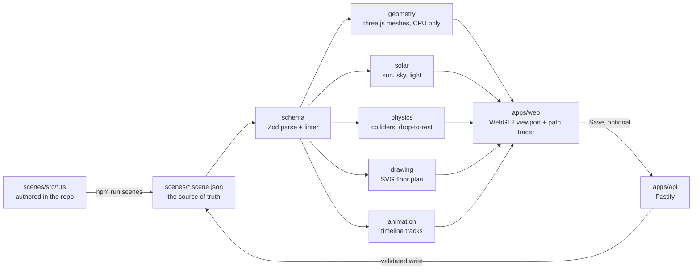

# Architecture

Solstice is an npm workspace: six packages that each do one job on the scene document, a browser app that puts them together, an optional API, and the scenes themselves. The document is the centre. Everything else either writes it, checks it or derives something from it.

- **schema** holds the document types, the Zod parse, the semantic linter in `src/lint/` and `src/derive/`, the home for values that a generator and its checker both need, such as a wall's angle. It depends on nothing but Zod.
- **geometry** compiles the document into three.js meshes. Walls become solids, `three-bvh-csg` cuts the openings, roofs are lofted from a footprint and pitch. It never needs a WebGL context, so it is tested in Node.
- **solar** turns site, date and clock into a sun vector, sky and light, using `suncalc`.
- **physics** derives Rapier colliders from the document and drops a placement onto the surface below it.
- **drawing** renders a horizontal section of the house as an SVG plan, with no three.js and no DOM, so the plan is asserted in tests rather than eyeballed.
- **animation** evaluates keyframed tracks, such as the sun-path study's `solar.minutes`, without a renderer.
- **apps/web** is Vite and React 19. React draws the panels only; a `SandboxEngine` class owns the three.js renderer, scene, camera and loop. `three-gpu-pathtracer` produces the final stills.
- **apps/api** is Fastify with seven routes over the scene files, plus a `node:sqlite` index that can be thrown away and rebuilt.

## From document to pixels

1. A TypeScript builder in `scenes/src/` composes a scene. Loops and helpers are allowed here and only here.
2. `npm run scenes` evaluates it and writes canonical JSON. Nothing downstream sees TypeScript.
3. Zod checks the shape, then the linter checks what Zod cannot: openings on walls that do not exist, windows taller than their wall, overlapping openings, assets missing from the manifest. An invalid document is never written and never loaded.
4. The web app bundles the three scenes at build time and parses each one again when it opens.
5. The generator builds the meshes. The house, the `subject`, is fully detailed; the surroundings, the `context`, are instanced scatter at lower detail, which keeps the path tracer's BVH small enough to build.
6. The solar package places the sun for the scene's site and clock, and a matched HDRI supplies the image-based light.
7. The viewport renders in real time for work. Render hands the scene to the path tracer at the shot's own camera, clock and resolution, and saves the result.

## Going deeper

- [corpus/wiki/architecture.md](../corpus/wiki/architecture.md): the layer map and why the dependencies point the way they do
- [corpus/wiki/decisions.md](../corpus/wiki/decisions.md): WebGL2 over WebGPU, no React Three Fiber, files as truth, and the other locked calls
- [corpus/wiki/decisions-scene.md](../corpus/wiki/decisions-scene.md): how a scene is modelled and authored
- [corpus/wiki/glossary.md](../corpus/wiki/glossary.md): subject, context, shot, solar time and the rest of the vocabulary
- [corpus/wiki/budgets.md](../corpus/wiki/budgets.md): the triangle and instance limits a scene must stay under
